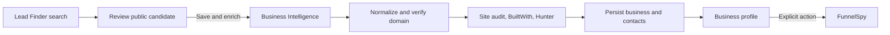

# Revora Phase 2 Report

Date: 2026-07-28
Phase: Lead Finder and Business Intelligence consolidation

## Outcome

Revora now separates public lead search from persistence and enrichment. The canonical flow is:

No canonical Lead Finder request generates a funnel.

## Behavior matrix

| Flow | Input | Output | Providers | Writes | Funnel | Failure / timeout | Duplicate rule | Consumer |
|---|---|---|---|---|---|---|---|---|
| Canonical Lead Finder | typed location, category, radius, limit, exclusion | `LeadSearchResponse` | Nominatim, Overpass | none | never | validation 400; location 404; provider 429/502; 15 s/35 s | OSM name/address, optional current funnel-domain exclusion | `/leads` |
| Local-business adapter | city, zipcode, address or query | original `businesses` envelope | shared canonical search | none | never | preserves legacy status envelope | shared implementation | `LocalBusinessFinder` |
| Canonical Discovery | candidate/business plus optional domain | business, contact, `BusinessIntelligenceProfile` | optional Nominatim, website, Site Audit, BuiltWith, Hunter | business and contact | only when `createFunnel === true` | website failure 422; provider absence becomes truthful status/warning; 10–20 s provider limits | `businesses.domain` and `(business_id,email)` existing constraints | `/leads` |
| Legacy Discovery | original fields plus explicit compatibility flag | original business/contact/funnel shape retained | same | business, contact, funnel | explicit `true` only | existing caller behavior retained | existing constraints | `AutoDiscovery`, `LocalBusinessFinder` |

## Canonical contracts

- `LeadCandidate` records OSM identity, public location/contact fields, evidence and nullable confidence.
- `LeadSearchRequest` supports typed location, category, safe radius, bounds contract, existing-record exclusion and safe limit.
- `LeadSearchResponse` records candidates, provider states, warnings and request metadata.
- `BusinessIntelligenceProfile` records normalized domain, website state, platform, technologies, contacts, public evidence, audit, provider states, warnings and timestamps.
- Missing provider facts are `null`, `unavailable`, `not_configured` or `not_checked`; they are not estimated.

## Route and compatibility changes

- `/api/lead-finder/search` is the canonical implementation.
- `/api/local-businesses` remains a response-compatible adapter.
- `/api/discovery` remains available. An omitted `createFunnel` is now unambiguously `false`.
- `/leads` is the canonical public-search and explicit-enrichment UI.
- `/businesses` and `/businesses/[id]` retain existing data and now expose evidence-based enrichment status.
- `/legacy`, all FunnelSpy routes, campaign routes, business/contact APIs and funnel routes remain.
- Both remaining legacy Discovery callers explicitly set `createFunnel:true`.
- Deprecation candidates for Phase 6: the local-business adapter and funnel-coupled legacy component actions, after usage/parity review.

## Provider behavior

| Provider | Status handling |
|---|---|
| Nominatim | success, rate limited or failed; required only for location search/domain discovery |
| Overpass | success or partial when the safe result limit is reached |
| BuiltWith | success, not configured or unavailable; existing key/tier and free-tier throttle/cache preserved |
| Hunter | success, not configured or unavailable; a missing public contact does not fail business persistence |
| Website / Site Audit | destination is normalized and DNS-checked against local/private networks before access; audit failure is a warning |

Provider credentials are never returned or logged.

## Domain and persistence rules

- The shared utility accepts HTTP/HTTPS, removes `www`, lowercases the hostname and removes path/query for identity.
- Malformed, localhost, `.local`, `.internal`, loopback, link-local and private destinations are rejected.
- Existing database uniqueness remains authoritative: `businesses.domain`; contacts use `(business_id,email)`.
- No schema, migration or unique constraint changed.

## Files

Created:

- `src/lib/lead-finder/contracts.ts`
- `src/lib/lead-finder/validation.ts`
- `src/lib/lead-finder/normalization.ts`
- `src/lib/lead-finder/search.ts`
- `src/lib/lead-finder/legacy.ts`
- `src/lib/business-intelligence/contracts.ts`
- `src/lib/business-intelligence/domain.ts`
- `src/lib/business-intelligence/request.ts`
- `src/components/leads/LeadFinder.tsx`
- `scripts/phase2-characterization.mjs`
- `PHASE_2_REPORT.md`

Modified:

- `src/app/api/lead-finder/search/route.ts`
- `src/app/api/local-businesses/route.ts`
- `src/app/api/discovery/route.ts`
- `src/app/(platform)/leads/page.tsx`
- `src/components/AutoDiscovery.tsx`
- `src/components/LocalBusinessFinder.tsx`
- `src/components/platform/BusinessesView.tsx`
- `package.json`

## Test coverage

`npm run test:phase2` executes without network access or production credentials and covers:

- request defaults, invalid input and safe limit
- lead mapping, evidence, nullable confidence and duplicate suppression
- domain normalization and malformed/local/private rejection
- legacy request/response mapping
- Discovery omitted flag defaults to no funnel
- explicit legacy funnel flag
- both legacy callers declare the flag

Optional provider failures are also isolated in the implementation and surfaced as statuses/warnings. Paid-provider execution is deliberately excluded from automated characterization.

## Validation

- `npm run lint`: passed.
- `npm run typecheck`: passed.
- `npm run build`: passed; 45 pages generated.
- `npm run test:phase2`: passed, 18 assertions.
- `git diff --check`: passed.
- API manifest: 29 route handler files remain.
- FunnelSpy source diff: empty.
- Database schema/migration diff: empty.
- Secret-pattern scan of changes: empty.
- Browser `/leads`: passed at desktop and 390×844.
- Browser `/businesses`: passed with existing persisted data.
- Browser `/businesses/1`: passed with existing business/contact/funnel data.

The characterization command emits Node's `MODULE_TYPELESS_PACKAGE_JSON` performance warning because it directly imports TypeScript under Node 25. It does not change runtime behavior or test outcome. The repository engine currently specifies Node 20.9–24.

## Known limitations and risks

- OSM coverage is public-data dependent; absence of a website/email is explicitly shown.
- Search bounds are represented in the contract but the preserved provider implementation currently uses radius search.
- Site-audit summaries are returned during enrichment but are not persisted because Phase 2 forbids a schema change; reloaded profiles mark them unavailable.
- Hunter source evidence is returned by canonical enrichment but the existing contacts table cannot persist source URLs.
- DNS validation reduces SSRF risk, but DNS rebinding protection would require request-layer address pinning in a later security phase.
- The old manual business API has its own simpler normalization and remains unchanged for compatibility.

## Phase 3 handoff

Phase 3 may consume persisted `BusinessIntelligenceProfile` facts to create an Opportunity Engine. It must not infer unavailable values, change FunnelSpy scoring, or reactivate implicit funnel creation. Phase 3 was not started here.
