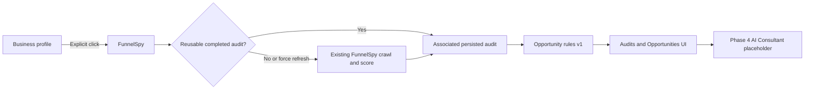

# Revora Phase 3 Report

Date: 2026-07-28

## Outcome

Phase 3 establishes FunnelSpy as the canonical deep-analysis engine and adds a deterministic Opportunity Engine over persisted audit evidence.



No page opening starts a crawl, AI call or funnel creation.

## Characterized baseline

| Flow | Providers / timeout | Persistence | Score / AI | Compatibility |
|---|---|---|---|---|
| Analyze | public HTML 12 s, Playwright 20 s, PageSpeed 20 s, RDAP 12 s, urlscan 8 s | PostgreSQL with memory fallback | existing deterministic score; no AI | preserved |
| History/detail | none | PostgreSQL or memory | read-only | preserved IDs/tokens |
| Compare | same analyzer, sequential 2–5 URLs | saves each result | unchanged score; no AI | preserved |
| AI report | OpenAI, 60 s route | attaches report | explicit AI action | preserved |
| Create funnel | funnel generator | business/funnel writes | explicit action requiring report | preserved |
| Export/share | none | reads persisted audit | read-only | preserved |
| Monitor | same analyzer on due schedule | monitor + audit | unchanged score | preserved |

The only callers of analyze, AI and create-funnel remain the legacy FunnelSpy screen. All `funnelspy_audits` access remains centralized in `funnelspy-store.ts`.

## Canonical contracts and reuse

`FunnelAuditRequest` adds:

- optional `businessId`
- URL
- locale
- `forceRefresh`
- comparison context
- requested capabilities

The canonical stored analysis remains the existing `FunnelSpyAnalysis`. Phase 3 adds association, storage mode, reuse metadata and provider/status interpretation without rewriting historical JSON.

Reuse policy:

- named constant: `AUDIT_FRESHNESS_DAYS`
- value: seven days
- requires completed page evidence
- requires matching normalized domain
- requires matching business identity when supplied
- excludes failed/incomplete results
- `forceRefresh:true` always crawls
- response states whether the audit was reused
- monitors continue their existing fresh scheduled crawl

## Schema change

Operational PostgreSQL was inspected before migration. It contained 14 audits and no FunnelSpy foreign keys.

Applied SQL:

```sql
ALTER TABLE funnelspy_audits
  ADD COLUMN IF NOT EXISTS business_id BIGINT
  REFERENCES businesses(id) ON DELETE SET NULL;

CREATE INDEX IF NOT EXISTS funnelspy_audits_business_created_idx
  ON funnelspy_audits(business_id, created_at DESC);

ALTER TABLE funnelspy_monitors
  ADD COLUMN IF NOT EXISTS business_id BIGINT
  REFERENCES businesses(id) ON DELETE SET NULL;
```

Verified:

- `business_id` exists as nullable `BIGINT`
- index exists
- historical audits remain valid with `NULL`
- deleting a business disassociates rather than deletes an audit

Rollback:

```sql
DROP INDEX IF EXISTS funnelspy_audits_business_created_idx;
ALTER TABLE funnelspy_audits DROP COLUMN IF EXISTS business_id;
ALTER TABLE funnelspy_monitors DROP COLUMN IF EXISTS business_id;
```

Canonical initialization now lives in `scripts/init-db.mjs`; the runtime store retains the same idempotent definition for deployment/startup compatibility. No SQLite, Drizzle or historical Supabase schema was modified.

## Opportunity Engine

Decision: opportunities are dynamically derived, not persisted.

Reasons:

- no Phase 3 lifecycle/status mutation is required
- deterministic recomputation preserves audit provenance
- avoids an unnecessary table
- rules are versioned as `opportunity-rules-v1`

Implemented rules:

- missing persisted funnel stages
- no lead-capture form
- no CTA
- no supported tracking signature
- mobile PageSpeed performance below 50
- accessibility below 70
- SEO below 70
- explicit global robots restriction

Every opportunity has a deterministic audit/rule key, evidence, exact audit ID, qualitative priority/impact, effort, confidence, recommended action and source rule. Missing PageSpeed evidence produces a warning rather than a performance conclusion.

The engine does not import or call FunnelSpy crawling, OpenAI, Hunter, BuiltWith, PageSpeed or any external provider.

## Routes

Changed:

- `POST /api/funnelspy/analyze`
  - validates the canonical request
  - validates business/domain association
  - applies explicit reuse policy
  - persists `business_id`
  - returns reuse/storage warnings
- `GET /api/funnelspy/history`
  - supports `businessId`
  - returns business, storage and opportunity summary
  - detail returns deterministic opportunities

Created:

- `GET /api/opportunities`
  - supports `auditId` or `businessId`
  - never crawls or calls AI
- `/businesses/[id]/opportunities`

Preserved:

- all existing FunnelSpy APIs and pages
- compare, monitor, export, sharing and explicit funnel creation
- all shared audit IDs and tokens

API route files increased from 29 to 30 through the additive Opportunity API.

## UI

- Business profile passes both normalized domain and business ID to FunnelSpy.
- FunnelSpy reads and pre-fills those values without running automatically.
- Business profiles list associated audits and derived opportunity counts.
- Audit index shows association, status, storage mode and opportunity count.
- Audit detail shows score, stages, pages, element evidence, CTAs, forms, tracking, technology, PageSpeed, RDAP, discovery facts, warnings and derived opportunities.
- Opportunity pages filter by business context, category, priority, effort and audit.
- Fresh audit, regenerate opportunities, sharing, export and existing funnel workflow remain explicit.
- AI Consultant is a disabled Phase 4 placeholder and was not implemented.

## Storage fallback

PostgreSQL remains primary. If schema/query persistence fails, FunnelSpy retains its current process-memory fallback. New API/UI metadata labels this mode as non-durable. A future production-hardening phase should make PostgreSQL required in production while retaining an explicit local-development mode.

## Files created

- `src/lib/funnel-audit/contracts.ts`
- `src/lib/funnel-audit/reuse.ts`
- `src/lib/opportunity-engine/contracts.ts`
- `src/lib/opportunity-engine/derive.ts`
- `src/lib/public-url-security.ts`
- `src/lib/funnel-score.ts`
- `src/app/api/opportunities/route.ts`
- `src/components/opportunities/OpportunitiesView.tsx`
- `src/app/(platform)/businesses/[id]/opportunities/page.tsx`
- `scripts/migrate-phase3-funnelspy-business.sql`
- `scripts/phase3-characterization.mjs`
- `PHASE_3_REPORT.md`

## Files modified

- `src/lib/funnelspy-store.ts`
- `src/lib/funnelspy.ts`
- `src/lib/business-intelligence/domain.ts`
- `src/app/api/funnelspy/analyze/route.ts`
- `src/app/api/funnelspy/history/route.ts`
- `src/app/api/funnelspy/monitor/route.ts`
- `src/app/funnelspy/page.tsx`
- `src/components/platform/AuditsView.tsx`
- `src/components/platform/BusinessesView.tsx`
- `src/app/(platform)/opportunities/page.tsx`
- `scripts/init-db.mjs`
- `package.json`
- `scripts/phase2-characterization.mjs`

`src/lib/funnelspy.ts` now reuses shared URL security and exposes version metadata. The unchanged scoring arithmetic was extracted to `funnel-score.ts` as `funnelspy-score-v1`. `src/lib/funnelspy-ai.ts` was not modified.

## Validation

- `npm run lint`
- `npm run typecheck`
- `npm run build` — 46 pages
- `npm run test:phase2`
- `npm run test:phase3` — 36 assertions, no network/provider calls
- `git diff --check`
- operational PostgreSQL migration verification
- desktop browser: business profile, prefilled explicit FunnelSpy, global opportunities, audit detail
- mobile browser: opportunities at 390×844
- secret-pattern scan
- FunnelSpy scoring source diff check

The first build failed because Next.js requires Suspense around `useSearchParams` on a static page. The implementation was changed to read query parameters after client mount; the next build passed.

## Completeness addendum

Priority methodology:

- `critical`: confirmed absence of every supported primary CTA signal.
- `high`: confirmed missing capture/conversion stage, zero forms, mobile performance below 50, or accessibility below 70.
- `medium`: other confirmed missing stages, tracking absence, SEO below 70, or an explicit robots restriction.
- `low`: reserved for non-urgent confirmed evidence; no current rule invents one.

Effort is `low` for localized configuration/content changes and `medium` for multi-component funnel, performance, accessibility or SEO work. `high` and `unknown` remain available but are not assigned without implementation evidence. Impact is qualitative and currently mirrors priority; it is never converted to revenue or conversion estimates.

Source-of-truth and version rules:

- `businesses.id` is the shared identity.
- Business Intelligence owns enrichment.
- Persisted FunnelSpy audits own deep evidence and score.
- Opportunities are a deterministic view of one audit and one rules version.
- Normalized domain aids lookup but never replaces business identity.
- New audits expose `funnel-audit-v1`, `funnelspy-crawler-v1` and `funnelspy-score-v1`.
- Opportunities expose `opportunity-rules-v1`.
- Version fields are optional for historical audit and shared-token compatibility.

Security:

- FunnelSpy and Business Intelligence share `public-url-security.ts`.
- Only HTTP/HTTPS are accepted.
- Malformed URLs, unsupported schemes, localhost, local-only names and metadata destinations are rejected.
- Loopback, private, carrier-grade NAT, link-local, multicast/reserved IPv4 and private/link-local IPv6 are rejected.
- DNS answers are checked before access.
- Errors are generic and do not reflect credentials, sensitive headers or raw provider failures.
- DNS rebinding remains a risk until outbound connections can be pinned to validated addresses.

Monitoring now accepts an optional business ID and scheduled audits retain it. Failed monitoring checks still save nothing and therefore cannot replace the latest valid audit. Monitoring calls neither AI nor funnel generation.

Every opportunity card shows its audit-derived date, rule, evidence, confidence, affected pages when available and recommended action.

Current execution limits:

| Operation | Limit |
|---|---:|
| Static/public-file fetch | 12 seconds each |
| Playwright navigation | 20 seconds per viewport |
| Internal crawl | up to 8 pages |
| PageSpeed | 20 seconds |
| RDAP | 12 seconds |
| urlscan screenshot lookup | 8 seconds |
| Analyze API | 60 seconds |
| AI endpoint | separate 60 seconds |
| Comparison | 2–5 sequential audits, 180 seconds |

Opportunity derivation is local and performs no I/O. Audits, comparisons, monitor batches, screenshots and AI reports should move to background jobs in a later infrastructure phase.

## Known limitations

- Historical audits are not auto-associated from domain because URL equality must not silently merge business identities.
- The persisted analysis JSON predates a formal audit-status column; completed status is derived only for successfully saved analyses with page evidence.
- Requested capabilities are validated and reserved for compatibility, while the existing analyzer still executes its established full capability set.
- The seven-day policy does not yet include per-provider capability version hashes.
- Runtime fallback remains non-durable.
- Opportunity status workflows require a future additive model only when accepted/dismissed/planned state is authorized.
- Comparison still performs fresh sequential crawls to preserve existing behavior.
- Redirect-time DNS rebinding cannot be fully prevented without connection address pinning.

## Phase 4 handoff

Phase 4 may consume a selected persisted audit and its versioned deterministic opportunities as evidence for an explicit AI Consultant request. It must not silently call AI, rewrite FunnelSpy scores, invent metrics or mutate opportunities without an authorized lifecycle design.

Phase 4 was not started.
